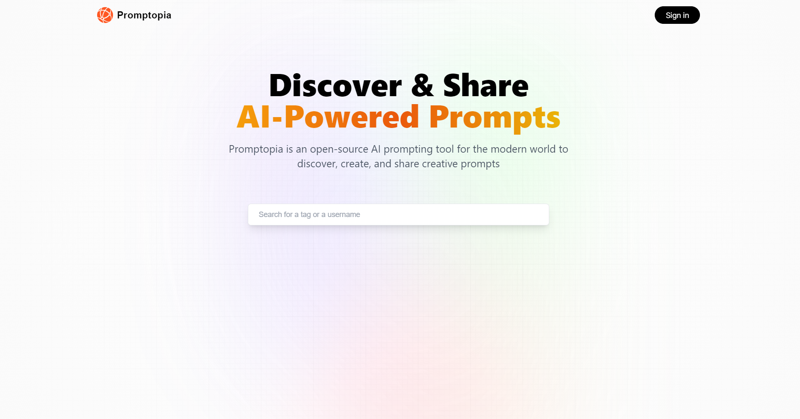
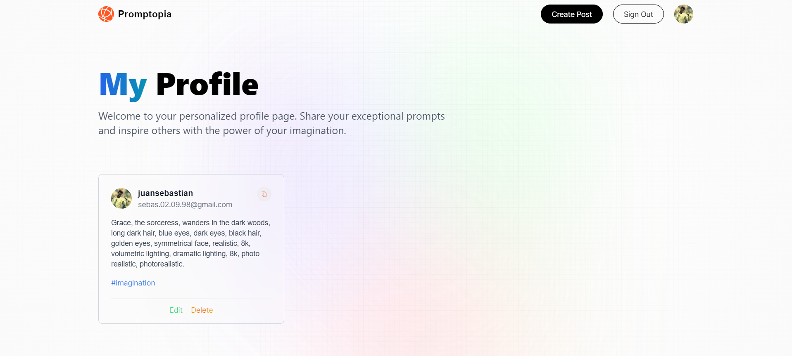
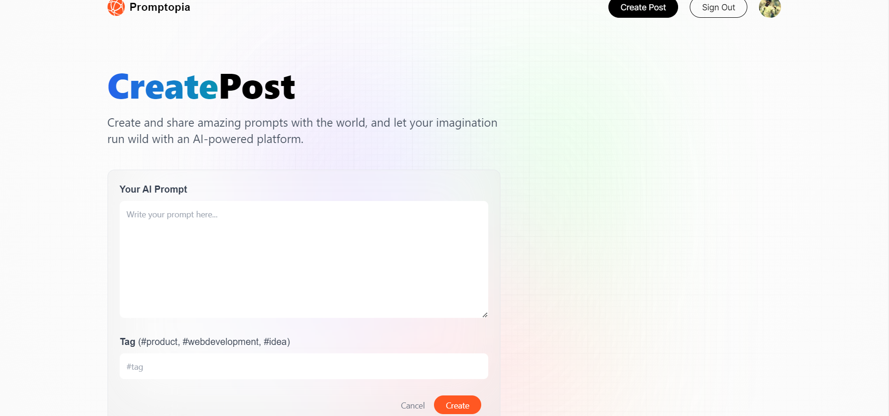
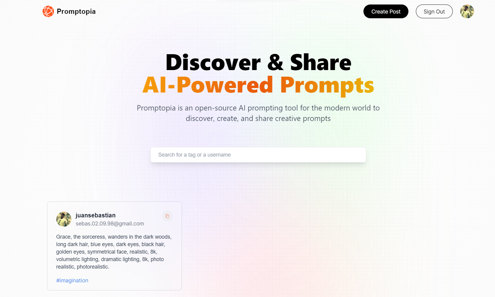

# Share Prompt App

The Share Prompt App is a web application that allows users to share creative writing prompts with others. It provides a platform for users to create, browse, and interact with writing prompts, fostering creativity and inspiration.

## Features

**Create Prompts:** Users can create their own writing prompts by providing a prompt description and adding relevant tags.

**Browse Prompts:** Users can explore a collection of writing prompts shared by other users, sorted by popularity, date, or tags.

**Interact with Prompts:** Users can like, comment on, and share prompts to engage with the writing community.

**User Profiles:** Each user has a profile that showcases their prompts and provides a way to connect with them.

**Authentication:** The app supports user authentication, allowing users to sign up, log in, and protect their prompts.

## Technologies Used

**Frontend:** The frontend of the Share Prompt App is built using React.js, Next.js, and Tailwind CSS. It provides an interactive user interface for creating, browsing, and interacting with prompts.

**Backend:** The backend is powered by Node.js and Express.js, with MongoDB as the database using Mongoose for data modeling and management. The backend handles API requests, authentication, and data storage.

**Authentication:** User authentication is implemented using NextAuth.js, which provides easy integration with popular authentication providers like Google, Facebook, and Twitter.

**Deployment:** The app is deployed on a cloud platform, in this case Vercel.

